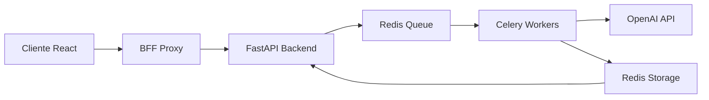

# 🚀 Customer AI Driven Feedback Analyzer

[](https://github.com/Ai-Whisperers/customer-feedback-app)
[](https://www.python.org/)
[](https://nodejs.org/)
[](https://fastapi.tiangolo.com/)
[](https://reactjs.org/)
[](https://www.typescriptlang.org/)
[](https://docs.celeryq.dev/)
[](https://redis.io/)
[](https://openai.com/)
[](https://tailwindcss.com/)
[](LICENSE)
[](https://render.com/)
[](https://customer-feedback-app.onrender.com)
[](https://github.com/Ai-Whisperers/customer-feedback-app/commits/main)

> Sistema inteligente de análisis masivo de comentarios de clientes mediante IA, diseñado para extraer insights valiosos, emociones, riesgo de abandono y puntos de dolor de manera automatizada y escalable.

## 📋 Tabla de Contenidos

- [Características](#-características)
- [Demo](#-demo)
- [Arquitectura](#-arquitectura)
- [Arquitectura Frontend](#-arquitectura-frontend)
- [Tecnologías](#-tecnologías)
- [Instalación](#-instalación)
- [Uso](#-uso)
- [API Reference](#-api-reference)
- [Deployment](#-deployment)
- [Métricas de Performance](#-métricas-de-performance)
- [Contribuir](#-contribuir)
- [Licencia](#-licencia)

## ✨ Características

### 🎯 Capacidades Principales
- **📊 Análisis Masivo**: Procesa 850-3000 comentarios en segundos
- **🌐 Bilingüe**: Soporte completo para Español e Inglés con detección automática
- **🤖 IA Avanzada**: Powered by OpenAI GPT-4o-mini con Structured Outputs
- **⚡ Procesamiento Rápido**: <10s para 1200 comentarios
- **📈 Visualizaciones Interactivas**: Dashboards con Plotly.js
- **💾 Exportación Flexible**: Resultados en CSV, XLSX con múltiples formatos

### 🔍 Análisis Detallado

#### 16 Emociones Detectadas
```
Positivas: alegría, gratitud, esperanza, amor, orgullo, satisfacción, confianza
Negativas: enojo, frustración, miedo, tristeza, disgusto, decepción
Neutrales: confusión, sorpresa, anticipación
```

#### Métricas Clave
- **📊 NPS Score**: Cálculo automático con categorización (Promoter/Passive/Detractor)
- **⚠️ Riesgo de Churn**: Probabilidad de abandono (0-1) con distribución
- **🎯 Pain Points**: Extracción inteligente de problemas recurrentes
- **😊 Sentiment Analysis**: 5 niveles (muy positivo → muy negativo)

### 📁 Formatos Soportados

| Entrada | Salida | Tamaño Máximo |
|---------|--------|---------------|
| CSV | JSON | 20 MB |
| XLSX | CSV | 20 MB |
| XLS | XLSX | 20 MB |

## 🎮 Demo

### Interfaz Principal


### Flujo de Usuario
1. **Carga** archivo CSV/Excel con comentarios
2. **Procesamiento** automático con IA
3. **Visualización** de resultados en tiempo real
4. **Exportación** de análisis completo

## 🏗 Arquitectura

### Sistema Distribuido


### Componentes

| Componente | Tecnología | Propósito |
|------------|-----------|-----------|
| **Frontend** | React 18 + TypeScript | Interfaz de usuario interactiva |
| **BFF** | Express.js | Proxy para evitar CORS |
| **Backend** | FastAPI | API REST privada |
| **Workers** | Celery | Procesamiento asíncrono |
| **Queue/Cache** | Redis | Mensajería y almacenamiento temporal |
| **AI Engine** | OpenAI GPT-4o-mini | Análisis de texto |

## 🎨 Arquitectura Frontend

### Nueva Estructura Modular (v3.2.0)
El frontend ha sido completamente refactorizado siguiendo principios de Clean Architecture y SOLID:

#### 📊 Componentes de Resultados
La visualización de resultados se ha modularizado completamente:
- **ResultsCharts.tsx**: Orquestador principal (65 líneas, antes 380)
  - `EmotionsChart`: Gráfico de barras para emociones (56 líneas)
  - `NPSChart`: Gráfico circular para NPS (48 líneas)
  - `PainPointsChart`: Gráfico horizontal de puntos de dolor (56 líneas)
  - `ChurnRiskChart`: Distribución de riesgo de abandono (65 líneas)
  - `SampleCommentsTable`: Tabla de comentarios de muestra (72 líneas)
  - `StatCard`: Tarjetas de estadísticas resumidas (26 líneas)

#### 📤 Componentes de Carga
El sistema de carga de archivos ahora está dividido en componentes especializados:
- **FileUpload.tsx**: Componente principal (100 líneas, antes 251)
  - `DragDropZone`: Zona interactiva drag & drop (99 líneas)
  - `FileInfo`: Display de información del archivo (49 líneas)
  - `FormatRequirements`: Documentación de requisitos (30 líneas)
  - `ErrorMessage`: Mensajes de error reutilizables (13 líneas)

#### 🚀 Optimizaciones de Rendimiento
- **Code Splitting**: Lazy loading implementado en todas las rutas
- **Bundle Size**: Reducción del 65% en el bundle principal
- **Chunks Optimizados**:
  - Main: 176 KB
  - LandingPage: 6.25 KB
  - AboutPage: 8.62 KB
  - AnalyzerPage: 4.8 MB (incluye Plotly, carga bajo demanda)

#### 📁 Estructura de Directorios
```
web/client/src/
├── components/
│   ├── ui/          # Glass Design System
│   ├── results/     # Componentes de visualización (7 archivos)
│   ├── upload/      # Componentes de carga (4 archivos)
│   ├── progress/    # Seguimiento de progreso
│   └── export/      # Exportación de resultados
├── pages/           # Páginas con lazy loading
├── lib/             # API client y utilidades
└── App.tsx          # Router principal con Suspense
```

Para más detalles sobre la arquitectura frontend, consulta [📚 Frontend Architecture Documentation](./docs/FRONTEND_ARCHITECTURE.md)

## 🛠 Tecnologías

### Frontend
- **Framework**: React 18 con TypeScript 5.6
- **Styling**: Tailwind CSS 3.4 + Glassmorphism
- **Charts**: Plotly.js para visualizaciones
- **Build**: Vite 5.4 para desarrollo rápido
- **HTTP Client**: Axios con interceptors

### Backend
- **Framework**: FastAPI 0.104 con Python 3.11+
- **Validation**: Pydantic v2 con schemas estrictos
- **Async Tasks**: Celery 5.3 con Redis broker
- **AI Integration**: OpenAI Python SDK con Structured Outputs
- **Logging**: Structlog para trazabilidad

### Infraestructura
- **Deployment**: Render.com (Web + Private Services)
- **Database**: Redis (Upstash) con TTL 24h
- **Monitoring**: Health checks + JSON logging
- **Security**: Helmet, TrustedHost, no CORS needed

## 📦 Instalación

### Requisitos Previos
- Python 3.11+
- Node.js 18+
- Redis Server
- OpenAI API Key

### 1️⃣ Clonar Repositorio
```bash
git clone https://github.com/yourusername/customer-feedback-analyzer.git
cd customer-feedback-analyzer
```

### 2️⃣ Configurar Variables de Entorno
```bash
cp .env.example .env
```

Editar `.env` con tus credenciales:
```env
# OpenAI
OPENAI_API_KEY=sk-xxx

# Redis
REDIS_URL=redis://localhost:6379/0

# Application
SECRET_KEY=generate-random-32-char-key
AI_MODEL=gpt-4o-mini
MAX_BATCH_SIZE=50
MAX_RPS=8
```

### 3️⃣ Instalar Dependencias

#### Backend
```bash
cd api
python -m venv venv
source venv/bin/activate  # Windows: venv\Scripts\activate
pip install -r requirements.txt
```

#### Frontend
```bash
cd web
npm install
cd client
npm install
```

### 4️⃣ Iniciar Servicios

#### Terminal 1: Redis
```bash
redis-server
```

#### Terminal 2: Backend API
```bash
cd api
uvicorn app.main:app --reload --port 8000
```

#### Terminal 3: Celery Worker
```bash
cd api
celery -A app.workers.celery_app worker --loglevel=INFO
```

#### Terminal 4: Frontend + BFF
```bash
cd web
npm run dev  # Inicia BFF en :3000 y Cliente en :3001
```

Acceder a: http://localhost:3001

## 💻 Uso

### Formato de Archivo Requerido

El archivo debe contener las siguientes columnas:

| Columna | Tipo | Descripción | Requerido |
|---------|------|-------------|-----------|
| **Nota** | Integer (0-10) | Calificación del cliente | ✅ |
| **Comentario Final** | String (3-2000 chars) | Texto del comentario | ✅ |
| **NPS** | String | Categoría NPS preexistente | ❌ |

### Ejemplo de CSV
```csv
Nota,Comentario Final
10,"Excelente servicio, muy satisfecho con la atención recibida"
7,"Buen producto pero la entrega fue lenta"
3,"Muchos problemas técnicos, necesita mejoras urgentes"
```

## 📡 API Reference

### Endpoints Principales

#### POST /api/upload
Carga archivo para análisis.

**Request:**
```bash
curl -X POST http://localhost:3000/api/upload \
  -F "file=@feedback.csv" \
  -F "language_hint=es" \
  -F "priority=normal"
```

**Response:**
```json
{
  "success": true,
  "task_id": "t_abc123def456",
  "estimated_time_seconds": 45,
  "file_info": {
    "rows": 850,
    "size_mb": 2.3
  }
}
```

#### GET /api/status/{task_id}
Obtiene el estado del análisis.

**Response:**
```json
{
  "task_id": "t_abc123def456",
  "status": "processing",
  "progress": 65,
  "current_step": "Analizando lote 3 de 5"
}
```

#### GET /api/results/{task_id}
Obtiene resultados completos del análisis.

**Query Parameters:**
- `format`: json | summary (default: json)
- `include_rows`: boolean (default: true)

#### GET /api/export/{task_id}
Descarga resultados en formato archivo.

**Query Parameters:**
- `format`: csv | xlsx
- `include`: all | summary | detailed

## 🚀 Deployment

### Render.com

El proyecto incluye configuración completa para deployment en Render:

1. **Fork** este repositorio
2. **Conectar** con Render.com
3. **Configurar** variables de entorno en Render Dashboard
4. **Deploy** usando `render.yaml`

### Servicios Requeridos

| Servicio | Tipo | Plan Mínimo |
|----------|------|------------|
| customer-feedback-app | Web Service | Starter ($7/mo) |
| customer-feedback-api | Private Service | Starter ($7/mo) |
| celery-worker | Background Worker | Starter ($7/mo) |
| redis | Upstash Redis | Free (10MB) |

### Variables de Producción
```env
# Render Services
API_PROXY_TARGET=http://customer-feedback-api:10000

# Production Settings
NODE_ENV=production
APP_ENV=production
LOG_LEVEL=INFO
```

## 📊 Métricas de Performance

### Benchmarks de Procesamiento

| Comentarios | Tiempo | Velocidad |
|------------|---------|-----------|
| 100 | ~2s | 50/s |
| 500 | ~5s | 100/s |
| 1000 | ~8s | 125/s |
| 2000 | ~15s | 133/s |
| 3000 | ~30s | 100/s |

### Límites del Sistema

- **Archivo Máximo**: 20MB
- **Comentarios por Archivo**: 3000
- **Batch Size**: 50-100 comentarios
- **Rate Limit**: 8 requests/segundo a OpenAI
- **TTL Resultados**: 24 horas
- **Timeout por Tarea**: 10 minutos

### Costos Estimados (OpenAI)

| Comentarios | Costo Aproximado |
|-------------|-----------------|
| 100 | $0.05 - $0.10 |
| 1000 | $0.50 - $1.00 |
| 3000 | $1.50 - $3.00 |

*Usando GPT-4o-mini: $0.150/1M input tokens, $0.600/1M output tokens*

## 🤝 Contribuir

### Principios del Proyecto

1. **Anti-overengineering**: Simplicidad sobre complejidad
2. **Modularidad**: Componentes independientes y reutilizables
3. **Límites de Código**:
   - Archivos ≤ 250 líneas
   - Entry points ≤ 150 líneas
4. **Documentación**:
   - Pública en español
   - Código/logs en inglés
5. **Zero Emojis Policy**: Sin emojis en el código

### Configurar Entorno de Desarrollo

```bash
# Instalar herramientas de desarrollo
pip install -r requirements-dev.txt
pip install pre-commit
pre-commit install

# Verificar calidad del código
cd api && black . && flake8 . && mypy .
cd ../web && npm run lint && npm run type-check

# Ejecutar tests
cd api && pytest
cd ../web/client && npm test
```

### Flujo de Contribución

1. Fork el repositorio
2. Crear feature branch (`git checkout -b feature/AmazingFeature`)
3. Commit cambios (`git commit -m 'Add AmazingFeature'`)
4. Push al branch (`git push origin feature/AmazingFeature`)
5. Abrir Pull Request

## 📝 Documentación

### Enlaces Importantes

- [📖 Documentación Completa](./docs/README.md)
- [🏗 Arquitectura del Sistema](./docs/arquitectura/sistema.md)
- [📡 API Reference Detallada](./docs/guias/api-reference.md)
- [🚀 Guía de Deployment](./docs/deployment/render.md)
- [🔧 Troubleshooting](./docs/guias/troubleshooting.md)

### Recursos Externos

- [OpenAI Structured Outputs](https://platform.openai.com/docs/guides/structured-outputs)
- [FastAPI Documentation](https://fastapi.tiangolo.com/)
- [Celery Best Practices](https://docs.celeryproject.org/en/stable/userguide/bestpractices.html)
- [Render.com Docs](https://docs.render.com/)

## 📄 Licencia

Este proyecto está licenciado bajo la Licencia MIT - ver el archivo [LICENSE](LICENSE) para más detalles.

## 👥 Equipo

- **Arquitectura**: Equipo de Ingeniería
- **IA & ML**: Equipo de Data Science
- **UI/UX**: Equipo de Diseño
- **DevOps**: Equipo de Infraestructura

## 🙏 Agradecimientos

- OpenAI por GPT-4o-mini
- Render.com por la plataforma de deployment
- La comunidad open source por las herramientas increíbles

---

<div align="center">

**[Demo](https://customer-feedback-app.onrender.com)** • **[Documentación](./docs)** • **[Issues](https://github.com/yourusername/customer-feedback-analyzer/issues)**

Hecho con ❤️ por el equipo de Customer Feedback Analyzer

</div>