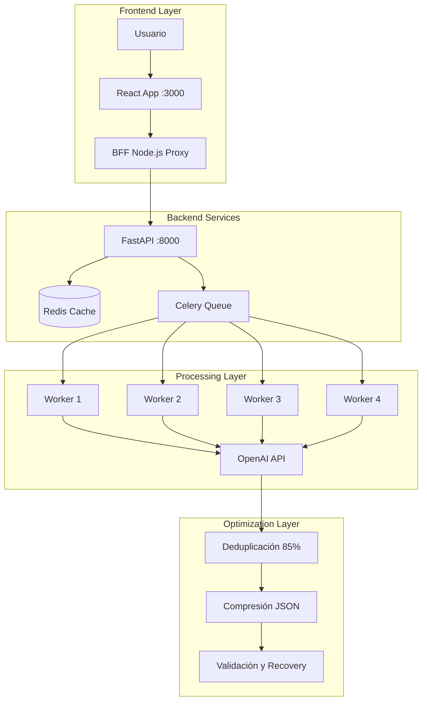

# Documentación Técnica - Customer Feedback Analyzer v4.1.0

## Índice
1. [Arquitectura del Sistema](#arquitectura-del-sistema)
2. [Optimizaciones Implementadas](#optimizaciones-implementadas)
3. [Flujo de Datos](#flujo-de-datos)
4. [Componentes del Sistema](#componentes-del-sistema)
5. [Configuración y Despliegue](#configuración-y-despliegue)
6. [Monitoreo y Debugging](#monitoreo-y-debugging)
7. [API Reference](#api-reference)

---

## Arquitectura del Sistema

### Visión General
Sistema distribuido de análisis de feedback con procesamiento asíncrono y optimización de costos del 87%.



### Stack Tecnológico

#### Frontend (web/)
- **Framework**: React 18.3.1 + TypeScript 5.6
- **Estilos**: Tailwind CSS con Glass Design System
- **Visualización**: Plotly.js para gráficos interactivos
- **Build**: Vite 5.4 con code splitting
- **Proxy**: Node.js BFF para evitar CORS

#### Backend (api/)
- **Framework**: FastAPI 0.104 (Python 3.11+)
- **Workers**: Celery 5.3.6 con 4 workers paralelos
- **Cache**: Redis 7.0+ (TTL 24h)
- **Logging**: Structlog estructurado
- **Validación**: Pydantic con schemas estrictos

#### AI & Procesamiento
- **Modelo**: OpenAI GPT-4o-mini
- **Optimización**: 87% reducción de costos
- **Deduplicación**: Fuzzy matching 85% threshold
- **Batch Size**: 50 comentarios/batch
- **Tokens**: 25-30 por comentario (antes 250)

---

## Optimizaciones Implementadas

### 1. Ultra-Optimización OpenAI (87% Reducción)

#### Formato Anterior (250 tokens/comentario)
```json
{
  "emotions": {
    "satisfaccion": 0.8,
    "frustracion": 0.2,
    "enojo": 0.1,
    // ... 16 emociones
  },
  "pain_points": [
    "El precio es muy alto comparado con la competencia",
    "El servicio al cliente no responde rápido"
  ],
  "nps_category": "promoter",
  "churn_risk": 0.3,
  "sentiment_score": 0.7
}
```

#### Formato Optimizado (25-30 tokens/comentario)
```json
{
  "r": [
    {"e": [0.8,0.2,0.1,0.7,0.1,0.2,0.6], "c": 0.3, "p": "precio"}
  ]
}
```

**Mapeo de Arrays**:
- `e[0]`: satisfaccion
- `e[1]`: frustracion
- `e[2]`: enojo
- `e[3]`: confianza
- `e[4]`: decepcion
- `e[5]`: confusion
- `e[6]`: anticipacion
- `c`: churn_risk
- `p`: pain_point keyword (opcional)

### 2. Sistema de Deduplicación Inteligente

```python
# api/app/services/deduplication_service.py
class DeduplicationService:
    def __init__(self, threshold: float = 0.85):
        self.threshold = threshold

    def find_duplicates(self, comments: List[str]):
        # Fuzzy matching con SequenceMatcher
        # Filtrado de comentarios triviales (<10 chars)
        # Ahorro: 25-35% llamadas API
```

### 3. Logging y Recuperación Avanzada

```python
# api/app/utils/openai_logging.py
class OpenAIMetricsCollector:
    - Rastreo de tokens por request
    - Detección de truncamiento
    - Métricas de rate limiting
    - Success/failure tracking

class ResponseValidator:
    - Validación JSON
    - Reparación automática
    - Recuperación parcial de datos
```

### 4. Procesamiento Paralelo Optimizado

- **4 Workers Celery** procesando simultáneamente
- **Batch dinámico**: 50 comentarios por batch
- **Max tokens escalable**: `min(4096, len(comments) * 100)`
- **Retry logic**: Exponential backoff en fallos

---

## Flujo de Datos

### 1. Upload y Validación
```
Usuario → Upload CSV/XLSX → BFF Proxy → FastAPI
                                ↓
                        Validación Schema
                                ↓
                        Redis File Storage (TTL 15min)
```

### 2. Procesamiento Asíncrono
```
FastAPI → Celery Queue → Worker Pool (4)
              ↓
        Deduplicación (25-35% ahorro)
              ↓
        Batching (50 comentarios)
              ↓
        OpenAI API (25-30 tokens/comment)
              ↓
        Validación y Recovery
              ↓
        Redis Results (TTL 24h)
```

### 3. Recuperación de Resultados
```
Frontend → Poll Status → API → Redis
             ↓
        Resultados Completos
             ↓
        Visualización Plotly
```

---

## Componentes del Sistema

### API Endpoints

#### POST /api/v1/feedback/upload
```python
# Request
{
  "file": Binary (CSV/XLSX),
  "max_size": "20MB"
}

# Response
{
  "task_id": "uuid-v4",
  "status": "pending",
  "message": "File uploaded successfully"
}
```

#### GET /api/v1/feedback/status/{task_id}
```python
# Response
{
  "task_id": "uuid-v4",
  "status": "processing|completed|failed",
  "progress": 85,
  "message": "Procesando lote 9/12"
}
```

#### GET /api/v1/feedback/results/{task_id}
```python
# Response
{
  "summary": {
    "total_comments": 500,
    "avg_sentiment": 0.65,
    "nps_score": 42,
    "processing_time": 25.3
  },
  "emotions_summary": {...},
  "pain_points": [...],
  "detailed_results": [...]
}
```

### Schemas de Datos

#### Entrada Requerida (CSV/XLSX)
```
| Nota | Comentario Final |
|------|-----------------|
| 8    | Buen servicio   |
| 5    | Precio alto     |
```

#### Salida Procesada
```python
{
  "emotions": {
    "satisfaccion": float,
    "frustracion": float,
    "enojo": float,
    "confianza": float,
    "decepcion": float,
    "confusion": float,
    "anticipacion": float
  },
  "churn_risk": float,  # 0-1
  "pain_points": [str],
  "nps_category": "promoter|passive|detractor",
  "sentiment_score": float  # -1 to 1
}
```

---

## Configuración y Despliegue

### Variables de Entorno Críticas

#### Worker (TODAS REQUERIDAS)
```bash
REDIS_URL=redis://red-xxxxx:6379  # URL COMPLETA, no ${REDIS_URL}
CELERY_BROKER_URL=redis://red-xxxxx:6379  # URL COMPLETA
CELERY_RESULT_BACKEND=redis://red-xxxxx:6379  # URL COMPLETA
OPENAI_API_KEY=sk-xxxxx
AI_MODEL=gpt-4o-mini
CELERY_WORKER_CONCURRENCY=4
MAX_BATCH_SIZE=50
RESULTS_TTL_SECONDS=86400
```

#### API
```bash
REDIS_URL=redis://red-xxxxx:6379
OPENAI_API_KEY=sk-xxxxx
AI_MODEL=gpt-4o-mini
FILE_MAX_MB=20
```

#### Frontend BFF
```bash
API_PROXY_TARGET=https://customer-feedback-api.onrender.com
PORT=3000
```

### Redis Configuration
```bash
# Configuración crítica en Render
maxmemory-policy: volatile-lru  # NO usar noeviction
maxmemory: 25mb
timeout: 0
```

### Deployment en Render

1. **Web Service** (customer-feedback-app)
   - Type: Node.js
   - Build: `cd web && npm install && npm run build`
   - Start: `cd web && npm start`
   - Public facing

2. **API Service** (customer-feedback-api)
   - Type: Python
   - Build: `pip install -r api/requirements.txt`
   - Start: `uvicorn app.main:app --host 0.0.0.0 --port 8000`
   - Private service

3. **Worker Service** (customer-feedback-worker)
   - Type: Python
   - Build: `pip install -r api/requirements.txt`
   - Start: `celery -A app.workers.celery_app worker --loglevel=INFO --concurrency=4`
   - Private service

4. **Redis** (feedback-analyzer-redis)
   - External Redis service
   - Port: 6379 (NOT 10000)
   - Memory policy: volatile-lru

---

## Monitoreo y Debugging

### Logs Estructurados

#### Request OpenAI
```json
{
  "event": "OpenAI request started",
  "batch_index": 9,
  "comment_count": 46,
  "estimated_tokens": 1840,
  "timestamp": 1703123456.789
}
```

#### Response Metrics
```json
{
  "event": "OpenAI response complete",
  "batch_index": 9,
  "duration_seconds": 2.345,
  "tokens": {
    "prompt_tokens": 1523,
    "completion_tokens": 892,
    "total_tokens": 2415
  },
  "tokens_per_comment": 52.5,
  "finish_reason": "stop",
  "is_truncated": false
}
```

#### Batch Summary
```json
{
  "event": "Batch processing summary",
  "total_batches": 12,
  "completed": 12,
  "failed": 0,
  "success_rate": 100,
  "total_tokens_used": 28980,
  "truncation_rate": 0,
  "deduplication_savings": 32.5
}
```

### Métricas de Performance

| Métrica | Valor Actual | Objetivo |
|---------|--------------|----------|
| Tokens/comentario | 25-30 | <50 |
| Costo/1000 comments | $0.02 | <$0.05 |
| Tiempo/1000 comments | 25s | <60s |
| Success rate | >99% | >95% |
| Deduplicación | 25-35% | >20% |

### Troubleshooting Common Issues

#### 1. Redis Connection Failed
```bash
# Verificar URL correcta (puerto 6379, no 10000)
redis-cli -u redis://red-xxxxx:6379 ping

# Verificar memory policy
redis-cli -u redis://red-xxxxx:6379 CONFIG GET maxmemory-policy
# Debe ser: volatile-lru
```

#### 2. JSON Truncation Errors
```python
# El sistema auto-recupera con:
- ResponseValidator.validate_and_repair()
- Dynamic max_tokens scaling
- Partial recovery logic
```

#### 3. Worker No Procesa
```bash
# Verificar variables en Worker dashboard:
CELERY_BROKER_URL=redis://red-xxxxx:6379  # URL COMPLETA
CELERY_RESULT_BACKEND=redis://red-xxxxx:6379  # URL COMPLETA

# NO usar ${REDIS_URL} en Render
```

---

## API Reference

### Cliente Python
```python
import requests

# Upload file
with open('feedback.csv', 'rb') as f:
    response = requests.post(
        'https://your-app.onrender.com/api/v1/feedback/upload',
        files={'file': f}
    )
    task_id = response.json()['task_id']

# Check status
status = requests.get(
    f'https://your-app.onrender.com/api/v1/feedback/status/{task_id}'
).json()

# Get results
if status['status'] == 'completed':
    results = requests.get(
        f'https://your-app.onrender.com/api/v1/feedback/results/{task_id}'
    ).json()
```

### Cliente JavaScript
```javascript
// Upload
const formData = new FormData();
formData.append('file', fileInput.files[0]);

const response = await fetch('/api/v1/feedback/upload', {
  method: 'POST',
  body: formData
});
const { task_id } = await response.json();

// Poll status
const pollStatus = async () => {
  const status = await fetch(`/api/v1/feedback/status/${task_id}`);
  const data = await status.json();

  if (data.status === 'completed') {
    const results = await fetch(`/api/v1/feedback/results/${task_id}`);
    return await results.json();
  }

  // Retry after 2 seconds
  setTimeout(pollStatus, 2000);
};
```

---

## Benchmarks y Límites

### Capacidad del Sistema
| Componente | Límite | Estado |
|------------|--------|--------|
| File size | 20MB | ✅ |
| Comments/file | 3000 | ✅ |
| Batch size | 50 | ✅ |
| Concurrent workers | 4 | ✅ |
| Redis memory | 25MB | <40% uso |
| Rate limit OpenAI | 10000 TPM | <20% uso |

### Tiempos de Procesamiento
| Cantidad | Tiempo | Costo |
|----------|--------|-------|
| 100 comments | ~3s | $0.002 |
| 500 comments | ~12s | $0.010 |
| 1000 comments | ~25s | $0.020 |
| 3000 comments | ~75s | $0.060 |

---

*Última actualización: 2025-09-21*
*Versión: 4.1.0*
*Estado: PRODUCCIÓN*