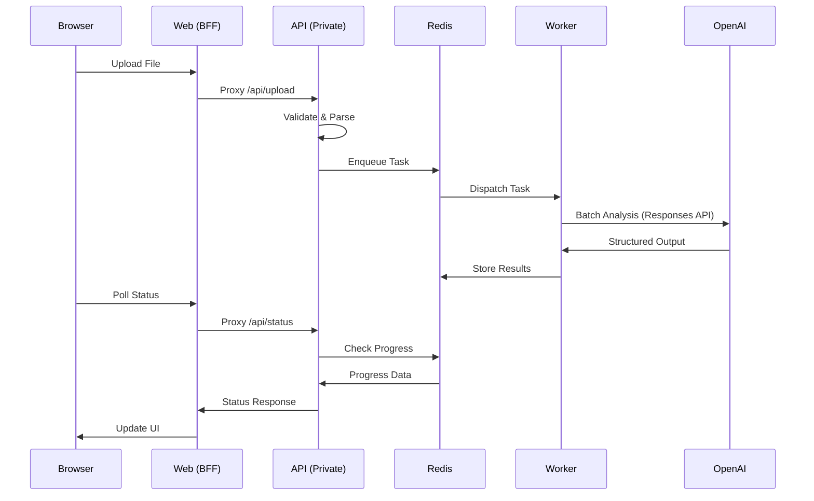

# Arquitectura del Sistema

## Visión General

El **Customer AI Driven Feedback Analyzer** utiliza una arquitectura de microservicios simplificada desplegada en Render.com, optimizada para análisis masivo de feedback con IA.

## Topología de Servicios

### 1. Servicio Web (Público)
**Tecnología**: Node.js 18+ con React + TypeScript + Express
**Función**: Backend-for-Frontend (BFF) y servidor de aplicación
**Ubicación**: `web/bff/server.ts`
**Características**:
- Sirve la aplicación React build desde `dist/client`
- Proxy reverso para llamadas API (`/api/*` → backend privado)
- Elimina necesidad de CORS completamente
- Puerto: 3000 (configurable via `PORT`)
- Middleware de seguridad con Helmet (configurable)
- Logging detallado de requests y duración
- Health checks en `/health` y `/debug/proxy`

### 2. Servicio API (Privado)
**Tecnología**: Python 3.11+ con FastAPI + Pydantic
**Función**: Orquestación y lógica de negocio
**Ubicación**: `api/app/main.py`
**Características**:
- No expuesto a Internet directamente (solo via BFF)
- Maneja uploads con validación modular (BaseFileParser/FlexibleParser)
- Sistema de parseo configurable via `PARSER_TYPE` env var
- Gestiona tasks asíncronas con Celery
- Puerto interno: 8000
- Rutas principales:
  - `/upload` - Recepción y validación de archivos
  - `/status` - Tracking de progreso de tasks
  - `/results` - Obtención de resultados analizados
  - `/export` - Exportación a Excel/CSV con formato profesional
- Almacena archivos en Redis (base64, TTL 4h para reintentos)

### 3. Servicio Worker (Privado)
**Tecnología**: Python 3.11+ con Celery + asyncio
**Función**: Procesamiento asíncrono y llamadas a OpenAI
**Ubicación**: `api/app/workers/`
**Características**:
- Tasks principales:
  - `analyze_feedback` - Task principal, coordina el análisis
  - `analyze_batch` - Subtask para procesar lotes en paralelo
  - `cleanup_expired_tasks` - Limpieza horaria de datos expirados
- Procesamiento paralelo de batches (actualmente deshabilitado)
- Rate limiting: 8 RPS máximo
- Reintentos con backoff exponencial (máx 3 para main, 2 para batch)
- Concurrencia configurable via `CELERY_WORKER_CONCURRENCY` (default: 4)
- Gestión de event loops con monitoreo (`@monitor_event_loop`)
- Deduplicación de comentarios via hash SHA256
- Cache de comentarios analizados (7 días TTL)

### 4. Redis (Externo)
**Proveedor**: Upstash o Redis privado
**Función**: Message broker y cache de resultados
**Namespaces de datos**:
- `file_content:{task_id}` - Archivos subidos (4h TTL)
- `task_status:{task_id}` - Estado de progreso (24h TTL)
- `task_results:{task_id}` - Resultados finales (24h TTL)
- `celery-task-meta-*` - Metadata de Celery
- `comment_cache:*` - Cache de análisis (7d TTL)
**Características**:
- Broker para Celery tasks (cola "celery" por defecto)
- Almacenamiento temporal con TTL automático
- Limpieza horaria de datos expirados
- Uso de memoria: ~100MB para 3000 comentarios
- Sin persistencia permanente (todos los datos son efímeros)

## Flujo de Comunicación



## Estructura del Monorepo

```
customer-feedback-app/
├─ api/                        # Backend FastAPI + Celery
│  ├─ app/
│  │  ├─ main.py              # Entry point (≤150 loc)
│  │  ├─ routes/              # Endpoints REST
│  │  ├─ services/            # Orquestación
│  │  ├─ core/                # Reglas de negocio
│  │  ├─ adapters/            # Integraciones externas
│  │  ├─ workers/             # Tasks Celery
│  │  ├─ schemas/             # Modelos Pydantic
│  │  └─ utils/               # Utilidades
│  └─ requirements.txt
│
├─ web/                        # Frontend React + BFF
│  ├─ src/
│  │  ├─ pages/               # Páginas con lazy loading
│  │  ├─ components/          # UI modularizado
│  │  │  ├─ ui/              # Glass Design System
│  │  │  ├─ upload/          # Componentes de carga (4 módulos)
│  │  │  ├─ results/         # Visualización (7 módulos)
│  │  │  ├─ progress/        # Tracking de progreso
│  │  │  └─ export/          # Exportación de resultados
│  │  ├─ lib/                 # API client y utilidades
│  │  └─ App.tsx             # Router con Suspense
│  ├─ bff/
│  │  └─ server.ts           # Express proxy server
│  └─ package.json
│
├─ docs/                       # Documentación pública
├─ tools/                      # Scripts y utilidades
└─ local-reports/             # Docs internas (EN)
```

## Principios Arquitectónicos

### 1. Anti-Overengineering
- Sin abstracciones prematuras
- Código directo y legible
- Optimización solo cuando sea medible

### 2. Modularidad Estricta
- Archivos ≤250 líneas
- Entry points ≤150 líneas
- Separación clara de responsabilidades
- Sin circular dependencies

### 3. Sin Estado de Usuario
- No hay sistema de autenticación
- Tasks identificadas por UUID
- Resultados con TTL automático

### 4. Proxy Pattern (BFF)
- Frontend solo habla con su servidor
- Elimina complejidad de CORS
- Centraliza configuración de API

## Capas de la Arquitectura

### Capa de Presentación (Web)
```typescript
// components/: UI puro, sin lógica de negocio
// features/: Módulos con estado y lógica
// api/: Cliente HTTP tipado con TypeScript
```

### Capa de Aplicación (API)
```python
# routes/: Endpoints REST, validación entrada
# services/: Casos de uso, orquestación
# schemas/: Contratos I/O con Pydantic
```

### Capa de Dominio (Core)
```python
# core/: Reglas de negocio puras
# - emotions.py: Lógica de análisis emocional
# - nps.py: Cálculos NPS
# - churn.py: Modelo de predicción
# - pain_points.py: Extracción de temas
```

### Capa de Infraestructura
```python
# adapters/: Integraciones externas
# - openai_client.py: Cliente Responses API
# - storage.py: Manejo de archivos
# - redis_client.py: Gestión de cache
```

## Escalabilidad

### Horizontal
- Workers Celery escalables independientemente
- Redis cluster para alto volumen
- CDN para assets estáticos

### Vertical
- Batch size dinámico (30-100 comentarios)
- Concurrencia ajustable por worker
- Rate limiting adaptativo

### Límites Actuales
- Max file size: 20MB
- Max comentarios: ~5000 por archivo
- Max concurrent tasks: 10 por instancia
- Rate limit: 80% del tier OpenAI

## Seguridad

### Validación de Entrada
- Whitelist de extensiones (.xlsx, .xls, .csv)
- Límite de tamaño estricto
- Sanitización de nombres de archivo
- Validación de columnas obligatorias

### Aislamiento de Red
- API y Workers no expuestos públicamente
- Comunicación interna via red privada Render
- Secrets en variables de entorno

### Gestión de Datos
- TTL automático (24h default)
- Sin persistencia de datos sensibles
- Logs sin información PII
- Resultados anónimos agregados

## Observabilidad

### Health Checks
```python
GET /api/health
{
  "status": "healthy",
  "services": {
    "api": "up",
    "redis": "connected",
    "celery": "4 workers active"
  },
  "timestamp": "2025-09-16T10:00:00Z"
}
```

### Logging Estructurado
```json
{
  "level": "INFO",
  "timestamp": "2025-09-16T10:00:00Z",
  "trace_id": "abc-123",
  "service": "api",
  "message": "Task completed",
  "duration_ms": 8500,
  "rows_processed": 850
}
```

### Métricas Clave
- **Latencia P50/P95/P99**
- **Throughput** (requests/min)
- **Error rate** por endpoint
- **Queue depth** (tasks pendientes)
- **Worker utilization**
- **OpenAI API usage**

## Módulos Recientes Implementados

### Sistema de Cálculo NPS Modular
**Ubicación**: `api/app/core/nps_calculator.py`
- Métodos disponibles: standard, absolute, weighted, shifted
- Configurable via `NPS_CALCULATION_METHOD` env var
- Método shifted por defecto (escala 0-100 positiva)

### Parser de Archivos Flexible
**Ubicación**: `api/app/core/file_parser.py` y `flexible_parser.py`
- BaseFileParser: Validación mecánica estricta
- FlexibleParser: Detección dinámica de columnas
- Selección via `PARSER_TYPE` env var

### Formateador Excel Profesional
**Ubicación**: `api/app/core/excel_formatter.py`
- 5 hojas con formato profesional
- Gráficos integrados con openpyxl
- Formato condicional y colores corporativos
- Habilitado via `EXCEL_FORMATTING_ENABLED`

### Monitor de Event Loops
**Ubicación**: `api/app/utils/event_loop_monitor.py`
- Decoradores no intrusivos para debugging
- Tracking de estados de loops y threads
- Logging detallado para diagnóstico de conflictos async
- Crítico para resolver conflictos Celery/asyncio

### Procesador Paralelo (Deshabilitado)
**Ubicación**: `api/app/adapters/openai/parallel_processor.py`
- Diseñado para procesamiento concurrente
- Actualmente deshabilitado por conflicto de event loops
- Configurado via `ENABLE_PARALLEL_PROCESSING=false`

## Decisiones Técnicas Clave

### ¿Por qué BFF?
- Elimina CORS complexity
- Centraliza configuración
- Mejora seguridad (API privada)
- Simplifica frontend

### ¿Por qué Celery?
- Robusto y battle-tested
- Excelente con Redis
- Retry mechanism built-in
- Visibilidad de tasks

### ¿Por qué Responses API?
- Structured Outputs garantizados
- Mejor manejo de streaming
- Event-driven architecture
- Diseñado para reasoning models

### ¿Por qué Render?
- Simplicidad de despliegue
- Red privada incluida
- Auto-scaling disponible
- Costo predecible

## Próximos Pasos

### Corto Plazo (v3.2)
- [ ] Implementar webhooks de notificación
- [ ] Cache de resultados frecuentes
- [ ] Dashboard de métricas básicas

### Mediano Plazo (v4.0)
- [ ] Multi-tenant con API keys
- [ ] Histórico de análisis
- [ ] Comparación temporal
- [ ] Export templates personalizables

### Largo Plazo (v5.0)
- [ ] Fine-tuning de modelos propios
- [ ] Análisis predictivo
- [ ] Integración con CRMs
- [ ] API pública documentada